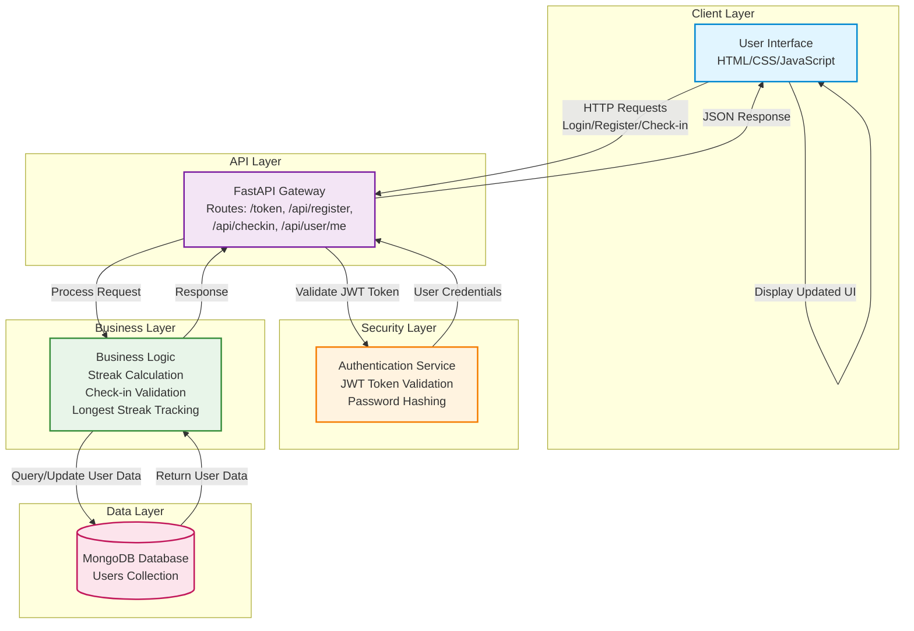
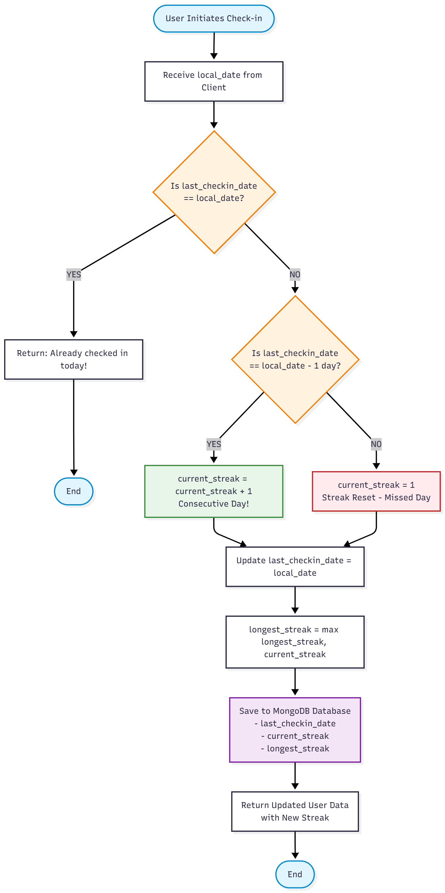
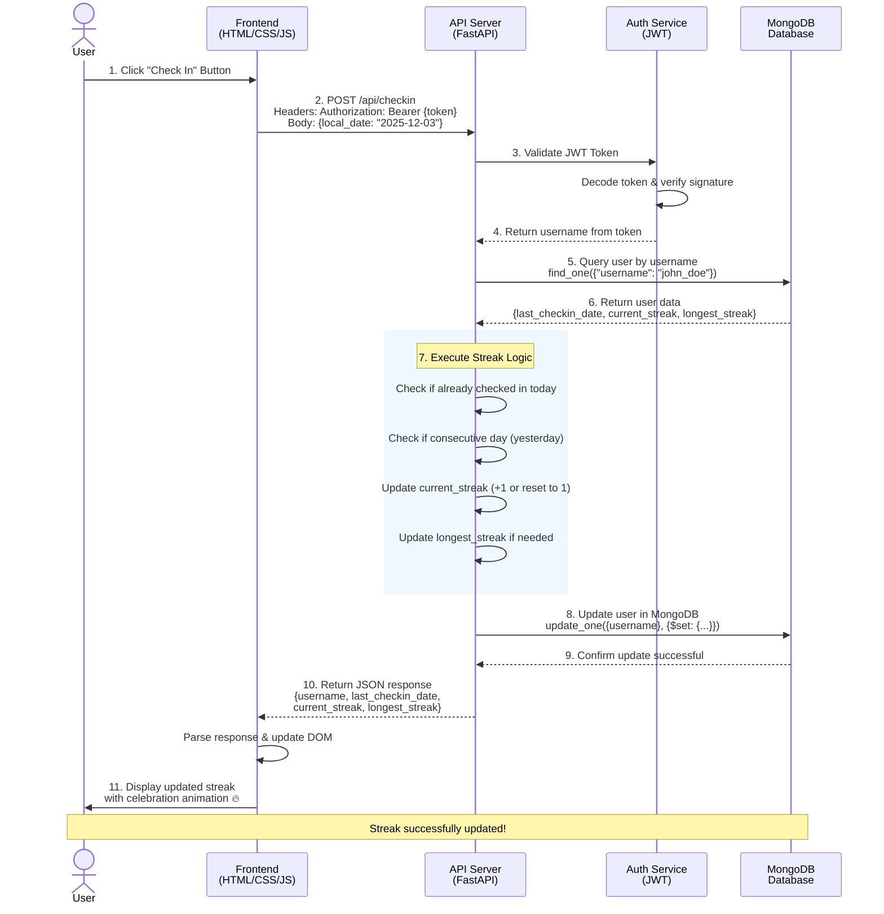

# Streak Gamification App - Complete Documentation

## Table of Contents
- [Project Overview](#project-overview)
- [Features](#features)
- [Technology Stack](#technology-stack)
- [Project Structure](#project-structure)
- [Installation & Setup](#installation--setup)
- [High-Level Workflow Diagram (System-Level)](#high-level-workflow-diagram-system-level)
- [Detailed Flowchart: Streak Update Logic](#detailed-flowchart-streak-update-logic)
- [Sequence for Daily Check-in Streak (Snapchat-like)](#sequence-for-daily-check-in-streak-snapchat-like)
- [API Endpoints](#api-endpoints)
- [Database Model](#database-model)
- [Development Notes](#development-notes)

---

## Project Overview

The **Streak Gamification App** is a web-based application designed to help users build habits by tracking daily check-ins. It features a streak system where users are rewarded for consecutive daily check-ins, similar to Snapchat's streak feature. The application includes user authentication, real-time streak updates, and a responsive user interface.

---

## Features

- **User Authentication**: Secure registration and login system using JWT (JSON Web Tokens)
- **Daily Check-in**: Users can check in once every day to maintain their streak
- **Streak Tracking**:
  - **Current Streak**: Counts the number of consecutive days checked in
  - **Longest Streak**: Tracks the highest streak achieved by the user
  - **Streak Reset**: Automatically resets the streak to 1 if a day is missed
- **Responsive UI**: A clean, dark-themed interface built with HTML, CSS, and Vanilla JavaScript
- **Persistent Data**: User data and streaks are stored in MongoDB database

---

## Technology Stack

### Backend
- **Language**: Python 3.x
- **Framework**: FastAPI (High-performance web framework)
- **Server**: Uvicorn (ASGI server)
- **Database**: MongoDB (NoSQL database)
- **Authentication**: Python-Jose (JWT handling), Passlib (Password hashing)
- **Validation**: Pydantic

### Frontend
- **Structure**: HTML5 (Jinja2 Templates)
- **Styling**: Vanilla CSS3 (Dark mode, responsive design)
- **Logic**: Vanilla JavaScript (Fetch API for backend communication)

---

## Project Structure

```
c:/Shubham/Office/Gammification/
├── .env                      # Environment variables (Secret keys, MongoDB URI)
├── .venv/                    # Python Virtual Environment
├── requirements.txt          # Python dependencies
├── init_mongodb.py           # MongoDB initialization script
├── test_api.py               # API testing script
├── test_mongodb.py           # MongoDB connection test
├── DOCUMENTATION.md          # Detailed documentation
├── MONGODB_MIGRATION.md      # MongoDB migration guide
└── app/                      # Main Application Directory
    ├── main.py               # App entry point & API routes
    ├── models.py             # Pydantic Database Models
    ├── schemas.py            # Pydantic Data Schemas
    ├── crud.py               # Database CRUD operations
    ├── auth.py               # Authentication logic & utilities
    ├── database.py           # MongoDB connection setup
    ├── templates/            # HTML Templates
    │   └── index.html        # Main application page
    └── static/               # Static Assets
        ├── style.css         # CSS Styles
        └── script.js         # Frontend JavaScript logic
```

---

## Installation & Setup

### Prerequisites
- Python 3.8+ installed on your system
- MongoDB installed and running (local or cloud instance)

### Steps

1. **Navigate to Project Directory**:
   ```bash
   cd c:/Shubham/Office/Gammification
   ```

2. **Activate Virtual Environment**:
   ```bash
   # Windows
   .venv\Scripts\activate
   ```

3. **Install Dependencies**:
   ```bash
   pip install -r requirements.txt
   ```

4. **Configure Environment Variables**:
   Create/update `.env` file with:
   ```
   SECRET_KEY=your_secret_key_here
   MONGODB_URI=mongodb://localhost:27017/
   DATABASE_NAME=streak_gamification
   ```

5. **Initialize MongoDB** (Optional):
   ```bash
   python init_mongodb.py
   ```

6. **Run the Application**:
   ```bash
   uvicorn app.main:app --reload
   ```

7. **Access the App**:
   Open your browser and navigate to: `http://127.0.0.1:8000`

---

## High-Level Workflow Diagram (System-Level)

This diagram illustrates the overall architecture and data flow of the Streak Gamification App:



### Component Breakdown:

1. **User Interface (Frontend)**
   - Built with HTML5, CSS3, and Vanilla JavaScript
   - Provides login, registration, and check-in interfaces
   - Stores JWT token in localStorage for session persistence

2. **API Gateway (FastAPI)**
   - Handles all HTTP requests from the frontend
   - Routes: `/token`, `/api/register`, `/api/checkin`, `/api/user/me`
   - Validates request data using Pydantic schemas

3. **Authentication Layer**
   - JWT-based authentication system
   - Validates tokens on protected endpoints
   - Password hashing using bcrypt

4. **Business Logic Layer**
   - Streak calculation algorithm
   - Check-in validation (prevent duplicate check-ins)
   - Longest streak tracking

5. **Database Layer (MongoDB)**
   - Stores user credentials and streak data
   - Collections: `users`
   - Handles data persistence and retrieval

### Data Flow:
1. User interacts with the frontend
2. Frontend sends authenticated requests to FastAPI
3. API validates JWT tokens
4. Business logic processes the request
5. Database operations are performed
6. Response is sent back to the frontend
7. UI updates to reflect changes

---

## Detailed Flowchart: Streak Update Logic

This flowchart shows the exact logic used to calculate and update user streaks during check-in:



### Streak Update Algorithm (from `crud.py`):

```python
def check_in(user: models.User, local_date: date) -> tuple[models.User, str]:
    """Handle user check-in and update streak"""
    
    # Step 1: Check if already checked in today
    if user.last_checkin_date == local_date:
        return user, "Already checked in today!"
    
    # Step 2: Update streak logic
    if user.last_checkin_date == local_date - timedelta(days=1):
        # Consecutive day - increment streak
        user.current_streak += 1
    else:
        # Missed a day - reset streak to 1
        user.current_streak = 1
    
    # Step 3: Update last check-in date
    user.last_checkin_date = local_date
    
    # Step 4: Update longest streak if current exceeds it
    user.longest_streak = max(user.longest_streak, user.current_streak)
    
    # Step 5: Save to MongoDB
    users_collection.update_one(
        {"username": user.username},
        {"$set": {
            "last_checkin_date": datetime.combine(local_date, datetime.min.time()),
            "current_streak": user.current_streak,
            "longest_streak": user.longest_streak,
        }}
    )
    
    return user, "Streak updated!"
```

### Key Logic Points:

1. **Duplicate Prevention**: If `last_checkin_date == local_date`, return early
2. **Consecutive Day Check**: If `last_checkin_date == local_date - 1 day`, increment streak
3. **Streak Reset**: If more than 1 day gap, reset `current_streak` to 1
4. **Longest Streak**: Always update to `max(longest_streak, current_streak)`
5. **Database Update**: Persist all changes to MongoDB

---

## Sequence for Daily Check-in Streak (Snapchat-like)

This sequence diagram shows the complete interaction flow when a user performs a daily check-in:



### Step-by-Step Sequence:

1. **User Action**: User clicks the "Check In" button in the UI

2. **Frontend Request**: 
   ```javascript
   fetch('/api/checkin', {
       method: 'POST',
       headers: {
           'Authorization': `Bearer ${token}`,
           'Content-Type': 'application/json'
       },
       body: JSON.stringify({
           local_date: new Date().toISOString().split('T')[0]
       })
   })
   ```

3. **API Receives Request**: FastAPI endpoint `/api/checkin` receives POST request

4. **Token Validation**: 
   - `get_current_user()` dependency extracts JWT token
   - Decodes token using `jose.jwt.decode()`
   - Validates signature and expiration

5. **User Retrieval**: 
   - Extract username from token payload
   - Query MongoDB: `users_collection.find_one({"username": username})`

6. **Database Response**: Returns user document with:
   - `username`
   - `hashed_password`
   - `last_checkin_date`
   - `current_streak`
   - `longest_streak`

7. **Streak Calculation**: Execute streak update logic (see flowchart above)

8. **Database Update**: 
   ```python
   users_collection.update_one(
       {"username": user.username},
       {"$set": {
           "last_checkin_date": mongo_last_checkin,
           "current_streak": user.current_streak,
           "longest_streak": user.longest_streak
       }}
   )
   ```

9. **API Response**: Return updated user data as JSON:
   ```json
   {
       "username": "john_doe",
       "last_checkin_date": "2025-12-03",
       "current_streak": 5,
       "longest_streak": 12
   }
   ```

10. **Frontend Update**: 
    - Parse JSON response
    - Update DOM elements with new streak values
    - Trigger celebration animation (if applicable)

11. **User Feedback**: Display updated streak count with visual feedback

---

## API Endpoints

### Authentication

#### `POST /token`
Login and retrieve an access token.

**Request Body** (OAuth2PasswordRequestForm):
```
username: string
password: string
```

**Response**:
```json
{
    "access_token": "eyJhbGciOiJIUzI1NiIsInR5cCI6IkpXVCJ9...",
    "token_type": "bearer"
}
```

#### `POST /api/register`
Register a new user.

**Request Body**:
```json
{
    "username": "john_doe",
    "password": "secure_password123"
}
```

**Response**:
```json
{
    "username": "john_doe",
    "last_checkin_date": null,
    "current_streak": 0,
    "longest_streak": 0
}
```

### User Operations

#### `GET /api/user/me`
Get current logged-in user details.

**Headers**:
```
Authorization: Bearer <token>
```

**Response**:
```json
{
    "username": "john_doe",
    "last_checkin_date": "2025-12-02",
    "current_streak": 4,
    "longest_streak": 10
}
```

#### `POST /api/checkin`
Perform a daily check-in.

**Headers**:
```
Authorization: Bearer <token>
```

**Request Body**:
```json
{
    "local_date": "2025-12-03"
}
```

**Response**:
```json
{
    "username": "john_doe",
    "last_checkin_date": "2025-12-03",
    "current_streak": 5,
    "longest_streak": 10
}
```

---

## Database Model

### User Collection (MongoDB)

```python
{
    "_id": ObjectId("..."),              # MongoDB auto-generated ID
    "username": str,                     # Unique username
    "hashed_password": str,              # Bcrypt hashed password
    "last_checkin_date": datetime | None,# Last check-in date (stored as datetime)
    "current_streak": int,               # Current consecutive days
    "longest_streak": int                # Highest streak achieved
}
```

### Pydantic Models (Python)

**User Model** (`models.py`):
```python
class User(BaseModel):
    username: str
    hashed_password: str
    last_checkin_date: Optional[date] = None
    current_streak: int = 0
    longest_streak: int = 0
```

**UserCreate Schema** (`schemas.py`):
```python
class UserCreate(BaseModel):
    username: str
    password: str
```

**UserResponse Schema** (`schemas.py`):
```python
class UserResponse(BaseModel):
    username: str
    last_checkin_date: Optional[date]
    current_streak: int
    longest_streak: int
```

---

## Development Notes

### Timezone Handling
- The client sends `local_date` (YYYY-MM-DD format) to ensure streaks are calculated based on the user's local time
- Server treats all dates as naive dates (no timezone info)
- This approach prevents timezone-related streak calculation errors

### Security
- Passwords are hashed using bcrypt (via Passlib)
- JWT tokens expire after 30 minutes (configurable in `auth.py`)
- Secret key should be stored in `.env` file (never commit to version control)

### Database
- MongoDB connection is established in `database.py`
- Database name and URI are configured via environment variables
- Dates are stored as `datetime` objects in MongoDB but converted to `date` objects in Python

### Frontend
- JWT token is stored in `localStorage` for session persistence
- Token is automatically included in all authenticated requests
- UI updates in real-time after check-in

### Testing
- `test_api.py`: Tests all API endpoints
- `test_mongodb.py`: Tests MongoDB connection
- Run tests with: `python test_api.py`

---

## Future Enhancements

- [ ] Add streak freeze feature (allow 1-2 missed days)
- [ ] Implement streak recovery (pay to restore broken streak)
- [ ] Add leaderboard to compare streaks with friends
- [ ] Send reminder notifications for check-ins
- [ ] Add achievements and badges for milestones
- [ ] Implement streak sharing on social media
- [ ] Add dark/light theme toggle
- [ ] Mobile app version (React Native / Flutter)

---

## License

This project is open-source and available for educational purposes.

---

## Contact & Support

For questions or issues, please contact the development team or create an issue in the project repository.

---

**Happy Streaking! 🔥**
